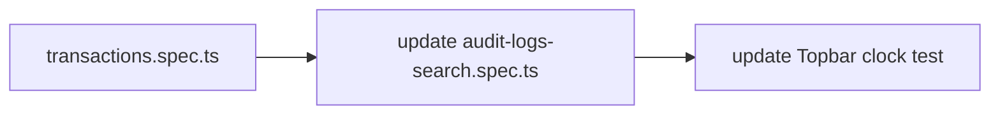
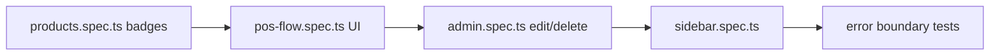

# E2E Test Coverage Analysis — Retail POS System

> Generated: 2026-06-17
> Total: **14 spec files**, **~222 test cases**, **~2.500+ lines**

---

## Existing Coverage

| File | Tests | Covers | Status |
|------|-------|--------|--------|
| `login.spec.ts` | 7 | Login flow, invalid credentials, error clearing | ✅ |
| `api-integration.spec.ts` | 10 | Health endpoint, admin users, auth header, error handling | ✅ |
| `dashboard.spec.ts` | 5 | JWT persistence, JWT payload decode, logout | ✅ |
| `dashboard-live.spec.ts` | 5 | Live stats cards, revenue update after sale broadcast, connection indicator | ✅ |
| `products.spec.ts` | 19 | Product table, search, category filter, add product, detail drawer, stock columns/badges, low stock filter, stock adjustment modal | ✅ |
| `audit-logs-search.spec.ts` | 24 | Search correctness, resource/action filters, date range, RBAC guard, pagination, export, refresh | ✅ |
| `roles.spec.ts` | 28 | Full create role modal: validation, permissions groups, search, expand/collapse, unsaved changes guard, toast, stale state reset | ✅ |
| `admin.spec.ts` | 5 | User create, username normalization, validation | ✅ |
| `customers.spec.ts` | 90 | Full CRUD: RBAC (5 roles), validation, isActive filter, audit logging, walk-in filtering, UI create/edit/deactivate/cancel/filter, unauthenticated guard | ✅ |
| `pos-flow.spec.ts` | 4 | Sale creation via API, products list, auth redirect | ✅ |
| `print-receipt.spec.ts` | 5 | Sale completion, print preview, reprint, styling | ✅ |
| `inventory-adjust-stock.spec.ts` | 10 | Adjust modal, positive/negative adjust, reject zero/null, cancel, RBAC (manager/cashier) | ✅ |
| `payment-methods.spec.ts` | 4 | List active methods, code lookup, 404 | ✅ |
| `reports.spec.ts` | 6 | **Skipped**: "Reports page not yet implemented". Only API tests run. | ⚠️ |

---

## Gap Analysis

### 🔴 High Priority (Timezone-Related)

| # | Area | File | What's Missing | Impact |
|---|------|------|----------------|--------|
| 1 | **TransactionsPage date filter** | `transactions.spec.ts` (new) | No E2E test for the Transactions page. Should verify date range selector sends `startDate`/`endDate` query params in YYYY-MM-DD format reflecting Jakarta midnight (07:00 UTC), not UTC midnight. | Backend relies on Jakarta boundary for date queries; untested filter could silently send wrong dates. |
| 2 | **Audit log date boundary** | Update `audit-logs-search.spec.ts` | Existing "changing date range filter works without errors" test doesn't assert the **correctness** of boundary dates. Should verify Last 7/30/90 days produce correct Jakarta UTC offsets. | Same — backend uses closed-open `[start, end+24h)` in Jakarta timezone. |
| 3 | **Topbar Jakarta clock** | Update `dashboard.spec.ts` or new | No assertion that the Topbar clock displays Asia/Jakarta time with `WIB` suffix. | Subtle bug: if clock shows server time (UTC) instead of Jakarta, users misread transaction times. |

### 🟡 Medium Priority (Missing Pages / Features)

| # | Area | File | What's Missing | Impact |
|---|------|------|----------------|--------|
| 4 | **ReportsPage charts** | Unskip `reports.spec.ts` | The entire Reports page is skipped with "not yet implemented" even though the implementation exists. Should test: daily/weekly/monthly/yearly chart rendering, period comparison, date range picker. | Major coverage gap — the analytics page is a core feature. |
| 5 | **CategoriesPage** | `categories.spec.ts` (new) | No E2E test for category CRUD. Existing tests only filter by category in products spec. | Category management is used throughout the app. |
| 6 | **TransactionsPage UI** | `transactions.spec.ts` (new) | Invoice list, search, pagination, sort, payment method filter, detail drawer. | Core feature with zero E2E coverage. |

### 🟢 Low Priority (Coverage Gaps)

| # | Area | File | What's Missing | Impact |
|---|------|------|----------------|--------|
| 7 | **ProductsPage stock badge CSS** | Update `products.spec.ts` | Badges exist but no assertion on variant CSS classes: `destructive` (critical), `warning` (low), `default` (normal). | Minor — visual correctness. |
| 8 | **PosPage full UI flow** | Update `pos-flow.spec.ts` | Only tests API calls. Missing: keyboard shortcuts (F2/F4), checkout modal, change calculation, receipt generation. | POS is the primary user-facing feature. |
| 9 | **UsersPage edit/delete** | Update `admin.spec.ts` | Only create user is tested. Missing: edit user (role change, deactivation), delete user with self-deletion guard. | Admin feature gap. |
| 10 | **Sidebar role-based visibility** | `sidebar.spec.ts` (new) | Customers spec has one sidebar test for staff. No comprehensive RBAC sidebar test. | UX correctness gap. |
| 11 | **Error boundaries** | New or existing | No test for graceful error handling: API down, network timeout, server 500. | User-facing experience. |

---

## Recommended Implementation Order

### Phase 1 — Timezone E2E (Priority: High)


### Phase 2 — New Pages (Priority: Medium)
```mermaid
graph LR
    D[Unskip reports.spec.ts] --> E[categories.spec.ts]
    E --> F[transactions.spec.ts (UI)]
```

### Phase 3 — Coverage Deepening (Priority: Low)


---

## Implementation Details

### Phase 1 — Timezone E2E

#### 1a. `transactions.spec.ts` (new file)

```typescript
// Pseudo-test outline
test.describe('Transactions Page — Timezone', () => {
  test.beforeEach(async ({ page }) => {
    await loginAs(page, 'superadmin', 'admin123');
    await page.goto('/transactions');
  });

  test('Topbar displays Asia/Jakarta time with WIB suffix', async ({ page }) => {
    const clock = page.locator('[data-testid="topbar-clock"]');
    await expect(clock).toContainText(/^\d{2}:\d{2} WIB$/);
  });

  test('date range filter sends Jakarta-boundary dates', async ({ page }) => {
    // Click "Last 30 Days"
    await page.getByRole('button', { name: 'Last 30 Days' }).click();
    const url = page.url();
    // Verify startDate and endDate are present
    expect(url).toMatch(/startDate=\d{4}-\d{2}-\d{2}/);
    expect(url).toMatch(/endDate=\d{4}-\d{2}-\d{2}/);
    // Calculate expected dates relative to Jakarta midnight (UTC 07:00)
    // e.g., if today in Jakarta is 2026-06-17, startDate should be 2026-05-18
    const jakartaDate = getTodayInJakarta();
    const expectedStart = new Date(jakartaDate);
    expectedStart.setDate(expectedStart.getDate() - 29);
    expect(url).toContain(`startDate=${formatDate(expectedStart)}`);
    expect(url).toContain(`endDate=${formatDate(jakartaDate)}`);
  });
});
```

#### 1b. Update `audit-logs-search.spec.ts`

Add within existing `test.describe('Audit Logs Search')`:

```typescript
test('Last 7 Days filter calculates correct Jakarta date boundaries', async ({ page }) => {
  await page.goto('/audit-logs?startDate=2026-06-10&endDate=2026-06-17');
  await expect(page.getByRole('table')).toBeVisible();

  // Verify that a log entry at 2026-06-16T23:59:59Z (which is 2026-06-17 06:59 WIB)
  // is INCLUDED in the results for endDate=2026-06-17
  // And a log at 2026-06-10T00:00:00Z (2026-06-10 07:00 WIB) is INCLUDED
  // for startDate=2026-06-10
});
```

#### 1c. Update Topbar clock

Add to `dashboard.spec.ts` or create a small test in any existing `beforeEach` flow:

```typescript
test('Topbar clock shows Jakarta time', async ({ page }) => {
  await page.goto('/');
  const clock = page.locator('[data-testid="topbar-clock"]');
  await expect(clock).toBeVisible();
  const text = await clock.textContent();
  expect(text).toMatch(/^\d{2}:\d{2} WIB$/);
});
```

---

## Pre-requisites

- Backend server running on `localhost:8080` with seed data spanning timezone boundaries
- Frontend dev server running on `localhost:5173`
- Playwright installed: `npx playwright install`
- Run with: `npx playwright test --config=tests/e2e/playwright.config.ts`
- Seed data must include:
  - Sales created at `16:59:59Z` and `17:00:00Z` (before/after Jakarta midnight)
  - Audit logs at boundary times
  - Products with critical/low/normal stock levels (for badge verification)

---

## Future Considerations

- **Performance / load tests**: Not yet considered — would be needed before production launch.
- **Visual regression tests**: Could add Playwright screenshot comparison for critical pages.
- **Accessibility tests**: `@axe-core/playwright` integration would catch a11y regressions.
- **Offline / PWA tests**: Not applicable (no PWA support currently).
