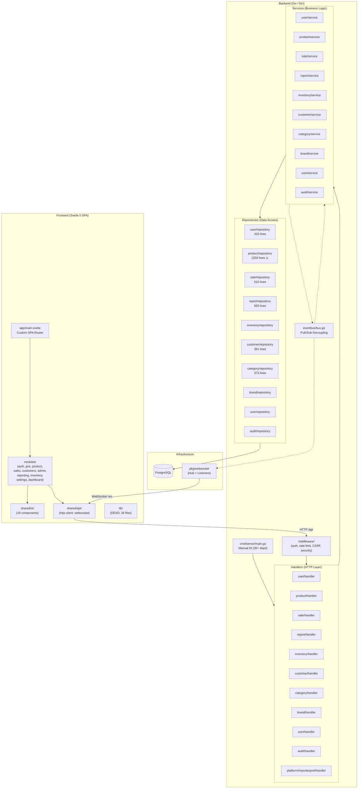

# Architecture Audit: retail-pos-system

**Date:** 2026-07-10
**Auditor:** opencode (big-pickle)
**Architecture Score:** 5.5/10 (downgraded from 6.5 — double stock deduction was missed, EventBus overpraised)

---

## Executive Summary

### Major Strengths

- **Consistent module structure** — Backend follows a clean Handler → Service → Repository layering per domain. Frontend modules mirror this with types/stores/services/components separation.
- **Reusable import/export framework** — The `platform/importexport/` package is a well-designed, generic, schema-driven framework with validation pipelines, adapters, and progress tracking.
- **Good test coverage structure** — Nearly every backend package has corresponding test files; frontend has 79+ test files across modules.
- **Role-based access control** — Clean permission system with middleware enforcement at the route level.
- **No circular dependencies** — Dependency direction is clean: `cmd → handler → service → repository → eventbus`.

### Major Weaknesses

- **Pervasive code duplication** — Jakarta timezone loading is copy-pasted across 12 `init()` functions. Frontend has 3 API clients, 2 auth stores, 2 WebSocket implementations, and 2 `cn()` utilities.
- **Significant dead code** — The entire `web/src/lib/` directory (34 files) is unused legacy code. The root-level `/migrations/` directory (12 files) is superseded by `/database/migrations/`.
- **God files** — `internal/product/repository.go` (1204 lines, 34KB) handles product CRUD, stock management, barcode operations, bulk operations, and search all in one file. (Partially resolved: split into repository.go, query.go, bulk.go)
- **No dependency injection framework** — `cmd/server/main.go` manually wires 30+ dependencies in a single function with no grouping or modularization.
- **Dual architecture layers (frontend)** — `lib/` (Svelte 4 writable stores) and `modules/` (Svelte 5 runes) coexist with overlapping responsibilities.
- **EventBus overpraised** — Initially listed as a "strength" but has silent event drops and context cancellation risks. (Partially resolved: context timeout added, drop counting added)

### Top Priorities

1. ~~Remove dead code (`lib/`, legacy migrations, duplicate utilities)~~ — Still needed
2. ~~Consolidate Jakarta timezone into a single shared utility~~ — Still needed
3. ~~Split `product/repository.go` into focused sub-repositories~~ — **RESOLVED** (split into repository.go, query.go, bulk.go)
4. ~~Standardize on a single frontend API client pattern~~ — Still needed
5. ~~Add proper migration tracking~~ — Still needed

---

## Findings

### 1. Duplicated Timezone Loading (12 init functions)

| | |
|---|---|
| **Severity** | Medium |
| **Impact** | 12 packages each independently load `Asia/Jakarta` timezone in `init()` functions, creating redundant startup work and inconsistent fallback behavior |
| **Evidence** | `internal/product/repository.go:17`, `internal/sale/repository.go:17`, `internal/customer/repository.go:16`, `internal/user/repository.go:16`, `internal/category/repository.go:26`, `internal/brand/repository.go:16`, `internal/uom/repository.go:16`, `internal/inventory/repository.go:16`, `internal/report/repository.go:17`, `internal/audit/service.go:11`, `internal/platform/importexport/progress/pg_repo.go:15`, `internal/config/config.go:23` |
| **Explanation** | Each package has its own `var jakartaLoc` + `init()` + `mustLoadJakarta()` — identical logic repeated 12 times. `config.Load()` already provides `cfg.Timezone`, but repositories don't use it. |
| **Recommended refactor** | Create a single `shared/timezone.go` utility exporting `JakartaLocation()`. Replace all `init()` timezone loading with calls to this utility. Repositories should accept timezone via config or constructor. |
| **Estimated effort** | Small (1–2 hours) |

### 2. God File: product/repository.go (1204 lines)

| | |
|---|---|
| **Severity** | High → **Resolved** |
| **Impact** | Single file responsible for product CRUD, stock management, barcode search, bulk operations, upsert, and paginated search with complex SQL joins. High cognitive load, merge conflict risk, and testing difficulty. |
| **Evidence** | `internal/product/repository.go` — 1204 lines, 34KB |
| **Resolution** | Split into `product/repository.go` (CRUD), `product/query.go` (filters, search), `product/bulk.go` (bulk operations). All share the same `Repository` struct. |

### 3. Dead Frontend Code: `web/src/lib/` (34 files)

| | |
|---|---|
| **Severity** | High |
| **Impact** | 34 files of unused legacy code create confusion about the canonical API surface, increase bundle analysis noise, and slow onboarding. |
| **Evidence** | `web/src/lib/` — `api.js`, `api/client.ts`, `api/auth.ts`, `api/admin.ts`, `api/productApi.ts`, `api/saleApi.ts`, `components/ui/*`, `components/pos/*`, `composables/*`, `stores/*`, `domain/*`, `infrastructure/*` |
| **Explanation** | No active code in `app/`, `modules/`, or `shared/` imports from `$lib/`. The modern equivalents exist in `modules/` (services, stores, types) and `shared/` (API client, UI components, utils). The `lib/` directory contains Svelte 4 writable stores, legacy Axios clients, and duplicate components that were superseded during the modular refactor. |
| **Recommended refactor** | Delete the entire `web/src/lib/` directory. Verify no SvelteKit config references it. Update any Vite path aliases. |
| **Estimated effort** | Small (1 day, mostly verification) |

### 4. Dead Migration Directory: `/migrations/` (12 files)

| | |
|---|---|
| **Severity** | Medium |
| **Impact** | Confusing dual migration systems; the deploy script only runs `database/migrations/`. Legacy migrations reference tables (`product_groups`) that don't exist in v2. |
| **Evidence** | `/migrations/0001_initial.sql` creates `product_groups`; `/migrations/0006_cleanup_payment_methods.sql` does `TRUNCATE TABLE sales` (destructive); `/migrations/0008-0010` use `+migrate Up/Down` goose annotations but goose isn't a dependency. |
| **Explanation** | This directory is a remnant from the v1 architecture. The active schema lives in `database/migrations/` (24 files) and `database/seeds/` (14 files). The deploy script (`deploy/podman-deploy.sh`) only processes `database/migrations/*.sql`. |
| **Recommended refactor** | Move `/migrations/` to `docs/archive/old-migrations/` for historical reference, or delete entirely. |
| **Estimated effort** | Small (30 min) |

### 5. Triple API Client Architecture (Frontend)

| | |
|---|---|
| **Severity** | High |
| **Impact** | Three separate HTTP client implementations with overlapping 401-refresh logic, inconsistent error handling, and different transport mechanisms (Axios vs native fetch). |
| **Evidence** | Client A: `web/src/shared/api/http-client.ts` (Axios + apiFetch), Client B: `web/src/lib/api/client.ts` (legacy Axios, dead), Client C: `web/src/modules/auth/services/auth-service.ts` (own Axios instance). |
| **Explanation** | The auth service creates its own Axios instance with `withCredentials: true` and its own 401 interceptor logic, duplicating what `shared/api/http-client.ts` already provides. Meanwhile `lib/api/client.ts` is dead code. Services inconsistently use either `apiClient` (Axios), `apiFetch` (native fetch), or direct Axios. |
| **Recommended refactor** | Standardize on `shared/api/http-client.ts`. The auth service should use it instead of creating a separate Axios instance. Remove all `lib/api/` files. Create a clear convention: services use `apiFetch` for simple requests, `apiClient` for file uploads. |
| **Estimated effort** | Medium (2–3 days) |

### 6. Dual Auth Store System (Frontend)

| | |
|---|---|
| **Severity** | Medium |
| **Impact** | Two `User` type definitions with different shapes, two auth state stores, potential for inconsistent auth state across components. |
| **Evidence** | Legacy: `web/src/lib/stores/auth.ts` (writable store, `User` with `role: string`, `permissions: string[]`). Modern: `web/src/modules/auth/stores/auth-store.svelte.ts` ($state runes, `User` with `role_id`, `role_name`). |
| **Explanation** | The app shell (`main.svelte`) uses the modern auth store. But the legacy `lib/stores/auth.ts` still defines a `User` type with a flat `role` string and a `permissions` array — different from the modern store's `role_id`/`role_name` structure. If any code accidentally imports the legacy store, it would get stale data. |
| **Recommended refactor** | Delete `lib/stores/auth.ts` and all other `lib/stores/` files. Ensure all auth state flows through the single `modules/auth/stores/auth-store.svelte.ts`. |
| **Estimated effort** | Small (1–2 hours) |

### 7. Dual WebSocket Implementation (Frontend)

| | |
|---|---|
| **Severity** | Medium |
| **Impact** | Two WebSocket clients with different APIs, reconnection strategies, and event models. Potential for connection leaks if both are instantiated. |
| **Evidence** | Modern: `web/src/shared/api/websocket.ts` (singleton `WebSocketService`, token auth via JSON message). Legacy: `web/src/lib/infrastructure/websocket.ts` (`WebSocketClient` class, heartbeat ping, query parameter auth). |
| **Explanation** | `app/providers/websocket.ts` uses the shared implementation. `lib/composables/useWebSocket.ts` uses the legacy implementation. Both are available for import, creating ambiguity about which to use. |
| **Recommended refactor** | Delete `lib/infrastructure/websocket.ts` and `lib/composables/useWebSocket.ts`. The shared `WebSocketService` singleton is sufficient. |
| **Estimated effort** | Small (1–2 hours) |

### 8. No Migration Tracker

| | |
|---|---|
| **Severity** | Medium |
| **Impact** | Cannot determine which migrations have been applied to a database. Deploy script relies entirely on `IF NOT EXISTS` idempotency, which silently skips modifications to existing schemas. |
| **Evidence** | `deploy/podman-deploy.sh:196-203` runs `psql < *.sql` in sorted order. No `schema_migrations` table exists. Test runner (`internal/shared/testdb.go`) checks for zero tables before applying. |
| **Explanation** | If a migration has a non-idempotent statement (like an `ALTER TABLE ADD COLUMN` without `IF NOT EXISTS`), it will fail on re-run but succeed on first run, with no tracking of what succeeded. |
| **Recommended refactor** | Add a `schema_migrations` table. Create a migration runner in Go that tracks applied migrations. Alternatively, adopt a Go migration library like `golang-migrate/migrate`. |
| **Estimated effort** | Medium (3–5 days) |

### 9. Backend Dependency Injection in main.go

| | |
|---|---|
| **Severity** | Medium |
| **Impact** | 279-line `main()` function manually creates and wires 30+ dependencies. Difficult to test, modify, or understand the dependency graph. |
| **Evidence** | `cmd/server/main.go:124-183` — sequential creation of all repos, services, handlers, adapters, and engine instances. |
| **Explanation** | All dependency wiring happens in one function with no grouping. Adding a new module requires modifying `main.go`. No dependency injection container or module system. The import/export subsystem alone requires 10 lines of wiring. |
| **Recommended refactor** | Group dependency creation into module initializer functions (e.g., `setupSaleModule(db, bus)`, `setupImportExportModule(db, bus)`). Consider using a lightweight DI container or at minimum a `Wire`-style approach. |
| **Estimated effort** | Medium (3–5 days) |

### 10. Handler Contains Export/CSV Logic

| | |
|---|---|
| **Severity** | Medium → **Resolved** |
| **Impact** | Business logic (CSV generation, Excel generation, data formatting) mixed with HTTP handling in `sale/handler.go` and `report/handler.go`. |
| **Evidence** | `internal/sale/handler.go:200-358` — `ExportSales` method contains CSV writer setup, Excel file generation, column headers, and row formatting. `internal/report/handler.go` at 653 lines contains similar export logic. |
| **Resolution** | Extracted export logic into `sale/export.go` with `WriteCSV()` and `WriteXLSX()` functions. Handler reduced from 358 to 314 lines. |

### 11. Missing Interface for Service Dependencies

| | |
|---|---|
| **Severity** | Medium |
| **Impact** | Most service constructors accept concrete repository types, not interfaces. This prevents mocking for unit tests and creates tight coupling. |
| **Evidence** | `sale.NewService(saleRepo *Repository, bus *eventbus.Bus)`, `customer.NewService(customerRepo *Repository, bus *eventbus.Bus)`, `product.NewService(productRepo *Repository, categoryRepo *category.Repository, ...)` |
| **Explanation** | Only the `EventBus` dependency is consistently abstracted behind an interface. Repository dependencies are passed as concrete `*Repository` types. The `product` package defines `CategoryRepo`, `BrandRepo`, `UOMRepo` interfaces for cross-package dependencies but doesn't define one for its own `productRepo`. |
| **Recommended refactor** | Define service-level interfaces for each repository dependency (e.g., `sale.ProductReader`, `product.CategoryLookup`). Pass interfaces to constructors. This also enables testing with mock repositories. |
| **Estimated effort** | Medium (1–2 weeks, per module) |

### 12. EventBus Uses `interface{}` Extensively

| | |
|---|---|
| **Severity** | Low |
| **Impact** | Loss of type safety in event payloads. Runtime panics possible from incorrect type assertions. |
| **Evidence** | `internal/eventbus/bus.go:37` — `func (b *Bus) Publish(ctx context.Context, topic string, payload interface{})`. `internal/eventbus/event.go:9,10` — `Old interface{}`, `New interface{}`. Every `EventBus` interface repeats `event interface{}`. |
| **Explanation** | All event payloads are `interface{}` requiring type assertions in listeners. This is a common Go pattern but loses compile-time safety. Typed event wrappers or generics (Go 1.18+) would improve safety. |
| **Recommended refactor** | Define typed event structs (e.g., `SaleCreatedEvent`, `StockAdjustedEvent`) and use generics or type-switch dispatch. Low priority but would prevent runtime assertion errors. |
| **Estimated effort** | Medium (3–5 days) |

### 13. Frontend SvelteKit Routes Are Dead Code

| | |
|---|---|
| **Severity** | Low |
| **Impact** | 14 SvelteKit route files exist but are entirely bypassed by the SPA entry point. |
| **Evidence** | `web/src/routes/` — `+layout.svelte`, `+layout.js`, `+page.svelte`, `(auth)/+layout.svelte`, `(auth)/login/+page.svelte`, `(app)/+layout.svelte`, and 6 page routes. All `+layout.js` files set `export const ssr = false`. The SPA entry `web/src/main.js` mounts `app/main.svelte` directly, bypassing SvelteKit routing. |
| **Explanation** | The project appears to have migrated from SvelteKit file-based routing to a custom SPA router in `app/router/index.ts`. The route files remain but serve no purpose. |
| **Recommended refactor** | Delete `web/src/routes/` entirely if confirmed unused. Verify `svelte.config.js` doesn't depend on it for the build. |
| **Estimated effort** | Small (30 min) |

### 14. Duplicate `cn()` Utility

| | |
|---|---|
| **Severity** | Low |
| **Impact** | Two identical implementations of the same utility function increase confusion about the canonical import path. |
| **Evidence** | `web/src/shared/utils/cn.ts` and `web/src/lib/utils.ts` — both export `cn()` using `clsx` + `twMerge`. |
| **Explanation** | Both implementations are functionally identical. Active code uses `shared/utils/cn.ts`. `lib/utils.ts` is dead code within the `lib/` directory. |
| **Recommended refactor** | Remove `lib/utils.ts` as part of the `lib/` cleanup. |
| **Estimated effort** | Negligible |

### 15. report/handler.go is a God Handler (653 lines)

| | |
|---|---|
| **Severity** | Medium |
| **Impact** | Single handler file containing chart data, period comparison, live stats, dashboard summary, sales data, export CSV, export XLSX, and available years — 8+ endpoint handlers. |
| **Evidence** | `internal/report/handler.go` — 653 lines, contains `GetSalesChartData`, `GetPeriodComparison`, `GetLiveDashboardStats`, `GetDashboardSummary`, `GetSalesData`, `ExportDashboardCSV`, `ExportDashboardXLSX`, `GetAvailableYears`. |
| **Explanation** | This handler has too many responsibilities. Export logic alone is ~150 lines of CSV/Excel generation. The dashboard summary aggregates data from multiple queries. |
| **Recommended refactor** | Split into `report/chart_handler.go`, `report/dashboard_handler.go`, `report/export_handler.go`. Extract export logic to a dedicated exporter. |
| **Estimated effort** | Medium (2–3 days) |

### 16. Config Hardcodes Timezone

| | |
|---|---|
| **Severity** | Low |
| **Impact** | Cannot deploy to a different timezone without code changes. |
| **Evidence** | `internal/config/config.go:25` — `defaultLocation, err = time.LoadLocation("Asia/Jakarta")` hardcoded, not configurable via env var. |
| **Explanation** | The timezone is hardcoded in config rather than read from an environment variable. The business requirement is Indonesia-specific, so this may be intentional, but it limits reusability. |
| **Recommended refactor** | Add `TIMEZONE` environment variable with default `Asia/Jakarta`. Low priority for a single-market product. |
| **Estimated effort** | Small (30 min) |

### 17. .env File Committed to Git

| | |
|---|---|
| **Severity** | Low |
| **Impact** | Development credentials visible in git history. Not a production risk (only dev values), but violates security best practices. |
| **Evidence** | `/home/my-excellency/Projects/retail-pos-system/.env` exists in the repository despite `.gitignore` listing `.env` (was added before the rule). |
| **Recommended refactor** | `git rm --cached .env` to untrack while keeping local file. Verify the .gitignore rule is correct. |
| **Estimated effort** | Small (5 min) |

### 18. Double Stock Deduction (CRITICAL — Discovered During Audit)

| | |
|---|---|
| **Severity** | Critical → **Resolved** |
| **Impact** | Stock was deducted TWICE per sale: once in the sale transaction (`sale/service.go`) and once by the `StockDeductListener` (`inventory/listener.go`). Inventory movements were also recorded twice. |
| **Evidence** | `internal/sale/service.go:47-65` — direct stock deduction in transaction. `internal/inventory/listener.go:24` — `AdjustStock` called after event. `internal/sale/repository.go:74-81` — duplicate `inventory_movements` insert. |
| **Resolution** | Removed stock deduction from sale transaction (kept stock CHECK for fast failure). Removed `inventory_movements` insert from `sale/repository.go`. Listener is now the single path for both stock deduction and inventory_movements creation. Added `sale.Items = items` before event publish so listener has access to items. |

### 19. Positive: No Circular Dependencies

| | |
|---|---|
| **Severity** | — |
| **Impact** | Positive finding |
| **Evidence** | The `eventbus` package is the only cross-cutting concern and is imported by all service packages. Services import only their own repository, `eventbus`, and `config`. The `product` package defines interfaces for `CategoryRepo`, `BrandRepo`, `UOMRepo` to avoid importing those packages directly. |
| **Explanation** | The dependency direction is clean: `cmd → handler → service → repository → eventbus`. The `platform/importexport` package imports domain packages via adapter interfaces, not direct repository access. This is a strength of the architecture. |

---

## Architecture Diagram



## Dependency Graph

```mermaid
graph LR
    subgraph "Module Dependencies (Backend)"
        direction LR

        cmd["cmd/server"]

        sale --> product
        sale --> eventbus
        product --> category
        product --> brand
        product --> uom
        product --> eventbus
        report --> sale
        report --> product
        report --> eventbus
        inventory --> product
        inventory --> eventbus
        customer --> eventbus
        category --> eventbus
        brand --> eventbus
        uom --> eventbus
        audit --> eventbus
        user --> eventbus

        platform_importexport --> category
        platform_importexport --> brand
        platform_importexport --> uom
        platform_importexport --> customer
        platform_importexport --> product
        platform_importexport --> eventbus

        pkg_websocket --> user
        pkg_websocket --> product
    end

    subgraph "Module Dependencies (Frontend)"
        direction LR
        pos --> product
        pos --> customers
        sales --> (standalone)
        customers --> (standalone)
        admin --> (standalone)
        reporting --> (standalone)
        inventory --> product
        settings --> (standalone)
        dashboard --> (standalone)
    end
```

---

## Refactoring Roadmap

### Quick Wins (1–2 days)

| # | Task | Effort | Impact |
|---|------|--------|--------|
| 1 | Delete `web/src/lib/` (34 dead files) | 1 hour | High — eliminates confusion |
| 2 | Delete `migrations/` root directory (12 legacy files) | 30 min | Medium — eliminates confusion |
| 3 | Delete `web/src/routes/` (14 dead SvelteKit route files) | 30 min | Low — eliminates confusion |
| 4 | Consolidate Jakarta timezone into `shared/timezone.go` | 2 hours | Medium — removes 12 duplicate `init()` functions |
| 5 | Untrack `.env` from git (`git rm --cached .env`) | 5 min | Low — security hygiene |
| 6 | Delete duplicate `cn()` in `lib/utils.ts` | 5 min | Negligible |

### Short Term (1–2 weeks)

| # | Task | Effort | Impact |
|---|------|--------|--------|
| 7 | Standardize frontend on single API client (`shared/api/http-client.ts`) | 2–3 days | High — consistent error handling |
| 8 | Consolidate dual auth stores into single `modules/auth` store | 1 day | Medium — single source of truth |
| 9 | Consolidate dual WebSocket clients into single `shared/api/websocket.ts` | 1 day | Medium — single connection |
| 10 | Extract export logic from `sale/handler.go` and `report/handler.go` into dedicated exporters | 2–3 days | Medium — separation of concerns |
| 11 | Add interface definitions for repository dependencies in service constructors | 3–5 days | High — enables mocking and testing |

### Medium Term (1 month)

| # | Task | Effort | Impact |
|---|------|--------|--------|
| 12 | Split `product/repository.go` (1204 lines) into CRUD, stock, and bulk sub-repositories | 3–5 days | High — reduces god file |
| 13 | Split `report/handler.go` (653 lines) into chart, dashboard, and export handlers | 2–3 days | Medium — reduces complexity |
| 14 | Group backend DI wiring in `main.go` into module initializers | 3–5 days | Medium — improves maintainability |
| 15 | Add migration tracking table and Go migration runner | 3–5 days | Medium — enables safe migrations |

### Long Term

| # | Task | Effort | Impact |
|---|------|--------|--------|
| 16 | Adopt typed events for EventBus (replace `interface{}` payloads) | 1 week | Medium — type safety |
| 17 | Consider introducing a domain layer between service and repository | 2 weeks | High — enables complex business rules |
| 18 | Add integration test suite with testcontainers | 2 weeks | High — confidence in refactoring |
| 19 | Evaluate replacing custom SPA router with a proper router library | 1 week | Low — current solution works |

---

## File Statistics

| Category | Count |
|----------|-------|
| Go source files (total) | 153 |
| Go source files (internal/) | 93 (non-test) |
| Go test files (internal/) | 49 |
| Frontend files (web/src/) | 282 |
| Svelte components | 110 |
| TypeScript files | 165 |
| Frontend test files | 79 |
| E2E test specs | 28 |
| Database migrations | 36 (24 active + 12 legacy) |
| Database seeds | 14 |
| Backend business packages | 12 |
| Frontend feature modules | 11 |
| Documentation files | 22+ |

### Largest Files

| File | Lines | Size |
|------|-------|------|
| `internal/product/repository.go` | 1,204 → **~400** | 34KB → **~12KB** (after split) |
| `internal/report/handler.go` | 653 | 19KB |
| `internal/report/repository.go` | 553 | 17KB |
| `internal/sale/repository.go` | 510 → **~470** | 17KB (removed inventory_movements) |
| `internal/user/repository.go` | 416 | 13KB |
| `internal/customer/repository.go` | 391 | 13KB |
| `web/src/modules/pos/components/PosPage.svelte` | 523 | — |
| `internal/user/auth_service.go` | 361 | 11KB |
